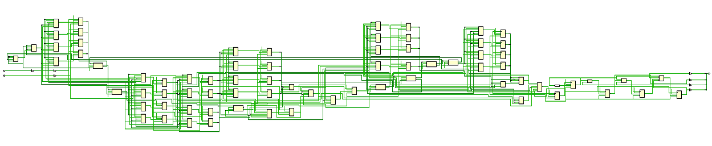
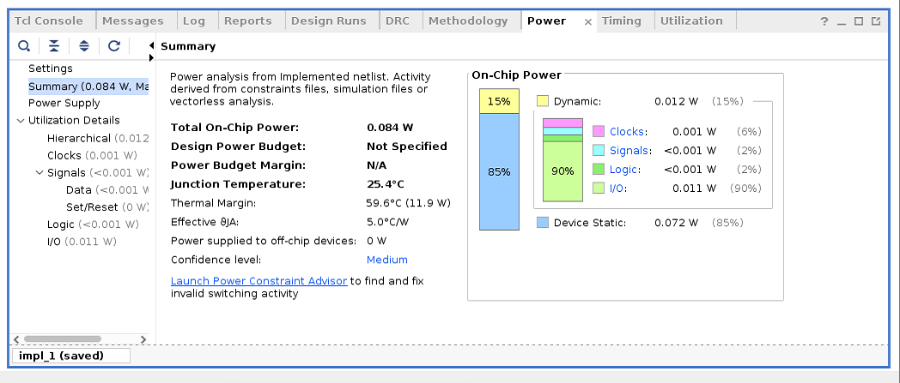
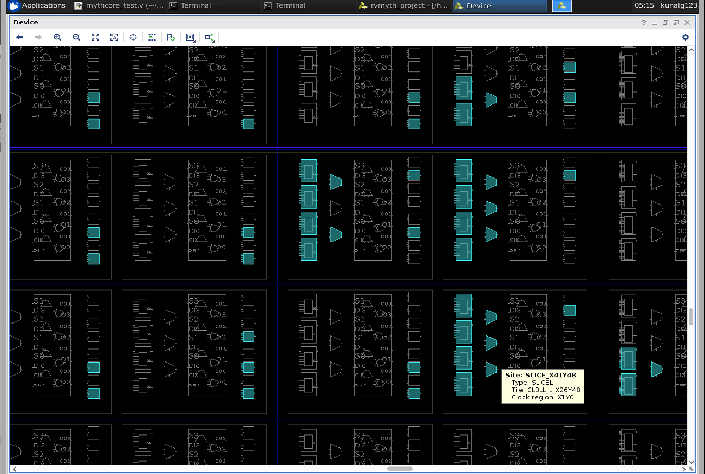
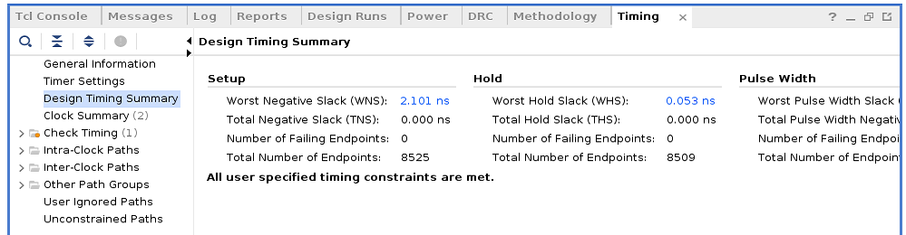
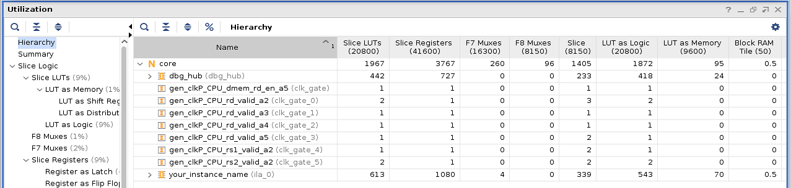
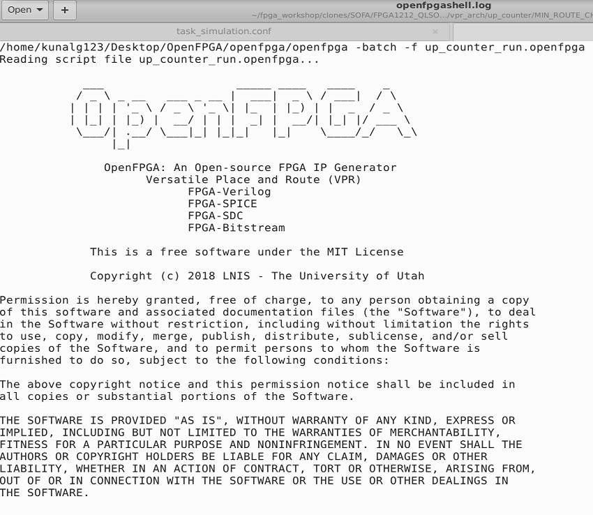
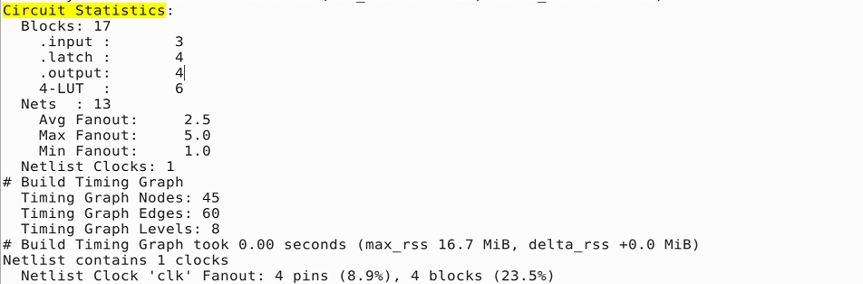
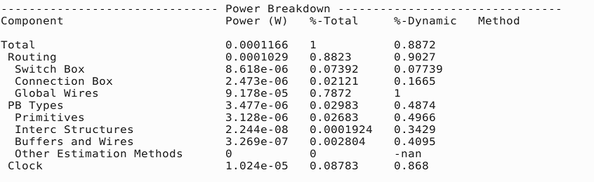
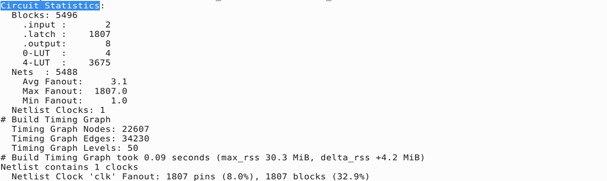
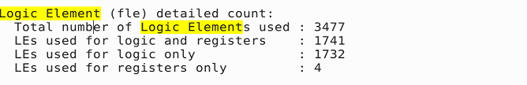

# FPGA - Fabric, Design and Architecture
  This repository contains all the information studied and created during the [FPGA - Fabric, Design and Architecture](https://www.vlsisystemdesign.com/fpga/) workshop. It is primarily foucused on a complete FPGA flow using the maximum open-soucre tools.

# Table of Contents
  - [Introduction To FPGA](#introduction-to-fpga)
    - [FPGA vs ASIC Comparison](#fpga-vs-asic-comparison)
  - [Day 1 - Exploring FPGA Basics and Vivado](#day-1---exploring-fpga-basics-and-vivado)
    - [FPGA Architecture](#fpga-architecture)
      - [Configurable Logic Block](#configurable-logic-block)
      - [Basys FPGA Board](#basys-fpga-board)
    - [Counter Example in Vivado](#counter-example-in-vivado)
      - [Counter Simulation and Elaboration](#counter-simulation-and-elaboration)
      - [Counter Synthesis](#counter-synthesis)
      - [Counter Implementation](#counter-implementation)
      - [Constraints](#constraints)
      - [Bitstream](#bitstream)
      - [Counter Timing, Power and Area](#counter-timing-power-and-area)
    - [Introduction To VIO](#introduction-to-vio)
  - [Day 2 - Exploring OpenFPGA, VPR and VTR](#day-2---exploring-openfpga-vpr-and-vtr)
    - [Introduction To OpenFPGA](#introduction-to-openfpga)
    - [VPR](#vpr)
    - [VTR](#vtr)
      - [VTR Flow](#vtr-flow)
      - [Post Synthesis Simulation](#post-synthesis-simulation)
      - [Timing Analysis VTR Flow](#timing-analysis-vtr-flow)
      - [Power Analysis VTR](#power-analysis-vtr)
  - [Day 3 - RISCV Core Programming Using Vivado](#day-3---riscv-core-programming-using-vivado)
    - [RTL To Synthesis](#rtl-to-synthesis)
    - [Synthesis To Bitstream](#synthesis-to-bitstream)
  - [Day 4 - Introduction To SOFA FPGA Fabric](#day-4---introduction-to-sofa-fpga-fabric)
    - [SOFA Counter Area](#sofa-counter-area)
    - [SOFA Counter Timing](#sofa-counter-timing)
    - [SOFA Counter Post Implementation](#sofa-counter-post-implementation)
    - [SOFA Counter Power](#sofa-counter-power)
  - [Day 5 - RISCV Core on Custom SOFA Fabric](#day-5---riscv-core-on-custom-sofa-fabric)
    - [SOFA RVMYTH Timing](#sofa-rvmyth-timing)
    - [SOFA RVMYTH Utilization](#sofa-rvmyth-utilization)
    - [SOFA RVMYTH Post Implementation](#sofa-rvmyth-post-implementation)
  - [References](#references)
  - [Acknowledgement](#acknowledgement)
 
# Introduction To FPGA
  FPGA (Field Programmable Gate Array) are intergated circuits which have a complex arrangement of configurable logic blocks (CLBs) and programmable interconnects. 
 
 ## FPGA vs ASIC Comparison
   | FPGA                                                                         | ASIC                                           |
   | ---                                                                          | ---                                            |
   | Field Programmable Gate Array                                                | Application Specific Integrated Circuit        |
   | RTL to Bitstream                                                             | RTL to Layout                                  |
   | Reconfigurable Circuit                                                       | Permanent Circuit                              |
   | Less Energy Efficient. Required more power for same task as compared to ASIC | More energy efficient                          |
   | Useful for prototyping or validating a design                                | Used for final product design after validation |

[comment]: <> (# Introduction To Xilinx Vivado)


# Day 1 - Exploring FPGA Basics and Vivado
 ## FPGA Architecture
   The FPGA Architecture primarily consists of :
    - Configurable Logic Blocks
    - Programmable Interconnects 
    - I/O Cells
    - Memory / Block RAM
    
   

  ### Configurable Logic Block
   Configurable Logic Block (CLB) is responsible for the combinational or sequential logic implementation. CLB consists of :
  
   - Look-up Table (LUT) - Logic function implementation
   - Carry and Control Logic - Arithmetic Operations
   - Flip-flops and/or latches
   


  ### Basys FPGA Board
  
   The FPGA used in this repository is Basys 3 Artix-7 FPGA. Below is the snippet of Basys3 FPGA board and some major elements on the board. 

   

   | No  | Description               | No  | Description    |
   | --- | ---                       | --- | ---            |
   | 01  | Power Good LED            | 09  | Reset          |
   | 02  | I/O                       | 10  | Jumper         |
   | 03  | I/O                       | 11  | Interface      |
   | 04  | Four 7-segment Display    | 12  | VGA Connector  |
   | 05  | Slide switches            | 13  | USB Port       |
   | 06  | LEDs                      | 14  | External Power |
   | 07  | Pushbuttons               | 15  | Switch         |
   | 08  | FPGA programming done LED | 16  | Jumper         |

 ## Counter Example in Vivado

   A 4-bit up counter is being used for exploring the Vivado tool and OpenFPGA. Below mentioned the RTL for the counter modules that is being used

   ```
    `timescale 1ns / 1ps
    //////////////////////////////////////////////////////////////////////////////////
    // Description: 4 bit counter with source clock (100MHz) division.

    module counter_clk_div(clk,rst,counter_out);
        
        input clk,rst;
        reg div_clk;
        reg [25:0] delay_count;
        output reg [3:0] counter_out;

        //////////clock division block////////////////////
        always @(posedge clk) begin

            if(rst) begin
                delay_count<=26'd0;
                div_clk <= 1'b0; //initialise div_clk
            end
            else
                if(delay_count==26'd212) begin
                    delay_count<=26'd0; //reset upon reaching the max value
                    div_clk <= ~div_clk;  //generating a slow clock
                end
                else begin
                    delay_count<=delay_count+1;
                end
            end
        end

        /////////////4 bit counter block///////////////////
        always @(posedge div_clk) begin

            if(rst) begin
                counter_out<=4'b0000;
            end
            else begin
                counter_out<= counter_out+1;
            end
        end

    endmodule 
   ```

  ### Counter Simulation and Elaboration
   The snippet below shows the behavioural simulation for the up counter.

   

   Elaboration binds modules to module instances, builds the model hierarchy, computes parameter values, resolves hierarchical names, establishes net connectivity, and prepares all of this for simulation.

   The snippet below is the schematic of the counter design after elaboration.

   

   In I/O planning, the ports for modules are assigned respective FPGA pins. The snippet below shows the details about I/O planning.

   

  ### Counter Synthesis
   Synthesis is the process that converts RTL into a technologyspecific gate-level netlist, optimized for a set of pre-defined constraints.

   The below snippet show sthe schematic generated by the Vivado synthesis tool.
   

  ### Constraints
   Constraints in simple are the specifications of your design like timing specifications, ports declaration, input/output delays, etc.

  ### Bitstream
   A bitstream is a binary sequence that comprises a sequence of bits. These are used in FPGA applications for programming purposes and to establish communication channels. FPGA bitstream is a file containing the programming data associated with your FPGA chip.

  ### Counter Timing, Power and Area
   Implementation of a design also gives details like the timing summary, device utilization, power analysis, etc. The below snippets show the brief timing sumary, implementation and power analysis of the up-counter design.

      
   
   

 ## Introduction To VIO
   Virtual Input/Output (VIO) core is a customizable core that can both monitor and drive internal FPGA signals in real time. The number and width of the input and output ports are customizable in size to interface with the FPGA design.

# Day 2 - Exploring OpenFPGA, VPR and VTR

 ## Introduction To OpenFPGA
  The OpenFPGA framework is the first open-source FPGA IP generator which supports highly-customizable homogeneous FPGA architectures. OpenFPGA provides a full set of EDA support for customized FPGAs, including Verilog-to-bitstream generation and self-testing verification. OpenFPGA targets to democratizing FPGA technology and EDA techniques, with agile prototyping approaches and constantly evolving EDA tools for chip designers and researchers.

  Some key features of OpenFPGA are:
    - Use of Automation Techniques
    - Reduction of FPGA developement cycle to few days
    - Provides open source design tools 

   

 ## VPR
   VPR (Versatile Place and Route) is an open source academic CAD tool designed for the exploration of new FPGA architectures and CAD algorithms, at the packing, placement and routing phases of the CAD flow.
   As input, VPR takes a description of an FPGA architecture along with a technology-mapped user circuit. It then performs packing, placement, and routing to map the circuit onto the FPGA. The output of VPR includes the FPGA configuration needed to implement the circuit and statistics about the final mapped design (eg. critical path delay, area, etc). 

   

   To invoke VPR from terminal:
   ```
    $VTR_ROOT/vpr/vpr \
    $VTR_ROOT/vtr_flow/arch/timing/EArch.xml \
    <blif-file-path \
    --route_chan_width 100 \
    --disp on
   ```

   The basic VPR flow involves below mentioned steps:

   - Packing - combinines primitives into complex blocks
   - Placment - places complex blocks within the FPGA grid
   - Routing - determines interconnections between blocks
   - Analysis - analyzes the implementation

## VTR
   The Verilog to Routing (VTR) project provides open-source CAD tools for FPGA architecture and CAD research. The VTR design flow takes as input a Verilog description of a digital circuit, and a description of the target FPGA architecture.

   VTR perfoms:

   - Elaboration & Synthesis (ODIN II)
   - Logic Optimization & Technology Mapping (ABC)
   - Packing, Placement, Routing & Timing Analysis (VPR)

   To invoke VTR from command-line:
    
    ```
     $VTR_ROOT/vtr_flow/scripts/run_vtr_flow.py \ 
     $VTR_ROOT/doc/src/<verilog-file-path>
     $VTR_ROOT/vtr_flow/arch/timing/EArch.xml \
     -temp_dir . \
     --route_chan_width 100 
    
    ```

## VTR Flow

   ### Timing Analysis VTR Flow
   In order to perform timing analysis, a constraint file needs to be created. This constraint file is provided as an input to tool. To perform timing analysis from command-line, below mentioned switch should be enabled.

    ```
     ## .sdc constraint file is required
     --sdc_file <sdc-file-path>
    ```

   The snippets below show the setup and hold timing reports generated by the tool.
   <table>
    <tr>
     <td></td>
     <td></td>
    </tr>
   </table>

   ### Post Synthesis Simulation
   Post Synthesis simulation in VTR flow is same as Post Implementation simulations in general. To generate the post synthesis netlist for simulation, the below mentioned switch should be enabled in during the VPR stage in VTR flow.
    
    ```
     ## To generate post synthesis netlist
     --gen_post_synthesis_netlist on
    ```

   The snippets below show the post synthesis netlist that is generated by the tool and the a behavioural simulation of the netlist in Vivado
   <table>
    <tr>
     <td></td>
     <td></td>
    </tr>
    <tr>
     <td rowspan="2"></td>
    </tr>    
   </table>

   ### Power Analysis VTR
   VTR provides a option to perform power analysis over the design. To enable power analysis in command-line, the switch mentioned below should be used.

    ```
    ## For power analysis
    -power -cmos_tech $VTR_ROOT/vtr_flow/tech/PTM_45nm/45nm.xml
    ```

   The snippet below shows a brief summary of the power analysis report generated by the VTR flow.
   

[comment]: <> ( ## Basys3 vs VTR Earch Comparison)

# Day 3 - RISCV Core Programming Using Vivado
   A 4-stage pipelined RISC-V core, named RVMYTH, is used in the repository. A complete RTL to Bitstream flow is implemented over the RVMYTH core. The Core is initially developed in High-level language named TL-Verilog and finally compiled to Verilog HDL.

 ## RTL To Synthesis

   The RISC-V RTL consists of multiple blocks/modules. Some of them are:
   - Instruction memory
   - Data memory
   - ALU
   - I/O ports

   The snippets below shows the behavioural simulation of the RVMYTH RISC-V core in vivado simulator. The instruction memory contains instructions for addition of integers from 1 to 9. The output signal in the waves display the final sum.

   

   The snippet below shows the elaboration stage where the FPGA pins are mapped to the RTL input/output ports.
   

   The design is synthesized in Vivado tool for Basys3 FPGA, along with some constraints. The below snippet show the schematic of design after synthesis and the constraints used for synthesis.

   
   

## Synthesis To Bitstream 
   During implementation, the synthesis design is traslated to a logic design file and mapped to small blocks and sub-blocks that can fit in FPGA CLBs. These blocks are then placed and routed in a optimized way.

   The snippet below shows a small part of the implemented design, the used LUTs, MUX and CLBs.

   

   The snippet below shows the timing summary for the RVMYTH implemented core.

   

   The snippet below shows the Device Utilization summary for the RVMYTH implemented core.

   

   The snippet below shows the power analysis for the RVMYTH implemented core.

   

# Day 4 - Introduction To SOFA FPGA Fabric

   SOFA (Skywater Opensource FPGAs) are a series of open-source FPGA IPs designed using open-source Skywater 130nm PDKs and OpenFPGA framework.  
   The FPGA IP design used in this repository is `FPGA1212_QLSOFA_HD_PNR` which has 50MHz of maximum operating speed, 1152 LUTs, 2304 Flip-flops, 1152 soft adders. The complete design is used over OpenFPGA framework and the various reports are generated.

[comment]: <> (   )

 ### SOFA Counter Area

   The snippet below shows the utilization of the counter in SOFA FPGA Fabric.

   

 ### SOFA Counter Timing

   The snippet below shows the setup and hold timing summary the counter in SOFA FPGA Fabric.

   
   

 ### SOFA Counter Post Implementation

   The snippet below shows the post implementation simulation of the counter in SOFA FPGA Fabric.

   

 ### SOFA Counter Power

   The snippet below shows the power analysis of the counter in SOFA FPGA Fabric.

   

# Day 5 - RISCV Core on Custom SOFA Fabric
  The RVMYTH discussed is now used along with the custom SOFA FPGA fabric. The design is then taken through the complete OpenFPGA framework and VTR flow. The various logs and reports generated as the outcome of the flow are mentioned in below sections.

 ### SOFA RVMYTH Timing

 The snippets below shows the setup and hold timing reports generated for RVMYTH core on SOFA FPGA Fabric by the tool.
   <table>
    <tr>
     <td></td>
     <td></td>
    </tr>
   </table>

 ### SOFA RVMYTH Utilization

  The snippets below shows the device utilization for RVMYTH core on SOFA FPGA Fabric by the tool.
   <table>
    <tr>
     <td></td>
     <td></td>
    </tr>
   </table>

 ### SOFA RVMYTH Post Implementation

  The snippets below shows the post implementation simulations for RVMYTH core on SOFA FPGA Fabric by the tool.
   

# References
  - VLSI System Design: https://www.vlsisystemdesign.com/ip/
  - RISC-V based Microprocessor: https://github.com/shivanishah269/risc-v-core
  - 4-stage RISC-V Core: https://github.com/ShonTaware/RISC-V_Core_4_Stage
  - SOFA: https://github.com/lnis-uofu/SOFA
  - OpenFPGA: https://openfpga.readthedocs.io/en/master/
  - VPR: https://docs.verilogtorouting.org/en/latest/vpr/
  - VTR: https://docs.verilogtorouting.org/en/latest/


# Acknowledgement
  - [Kunal Ghosh](https://github.com/kunalg123), Co-founder, VSD Corp. Pvt. Ltd.
  - [Nanditha Rao](https://github.com/nandithaec)
