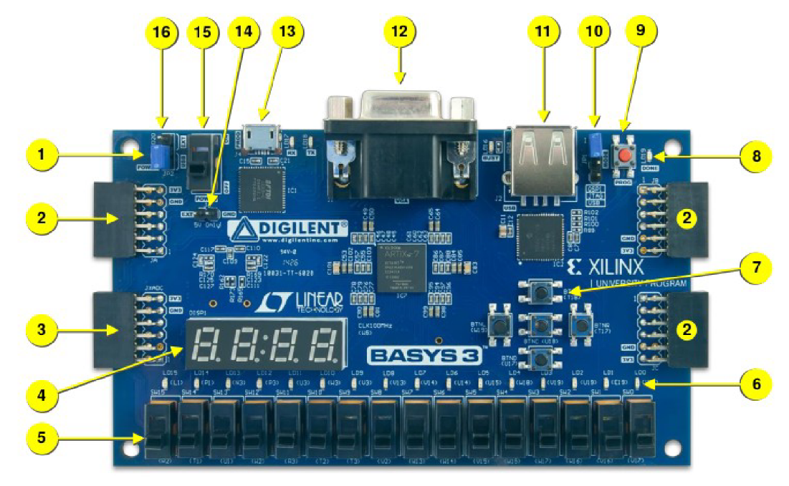
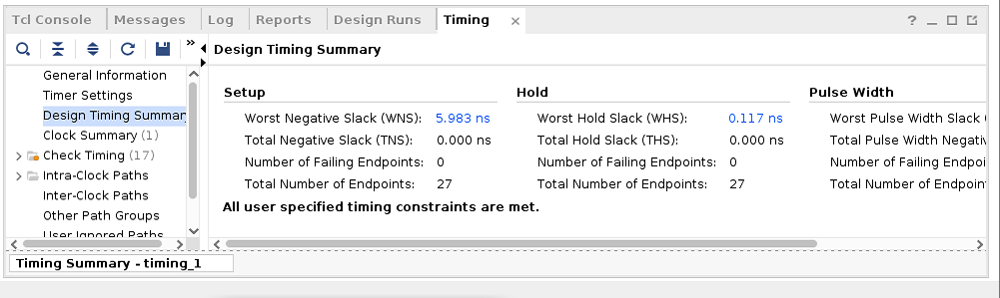
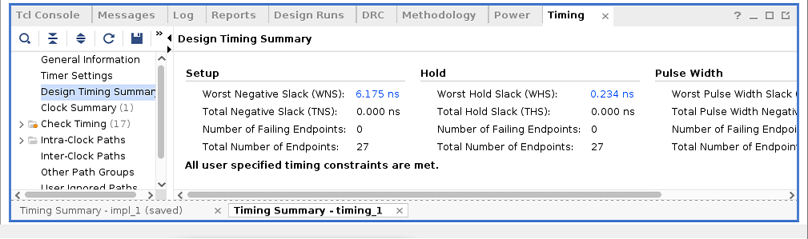
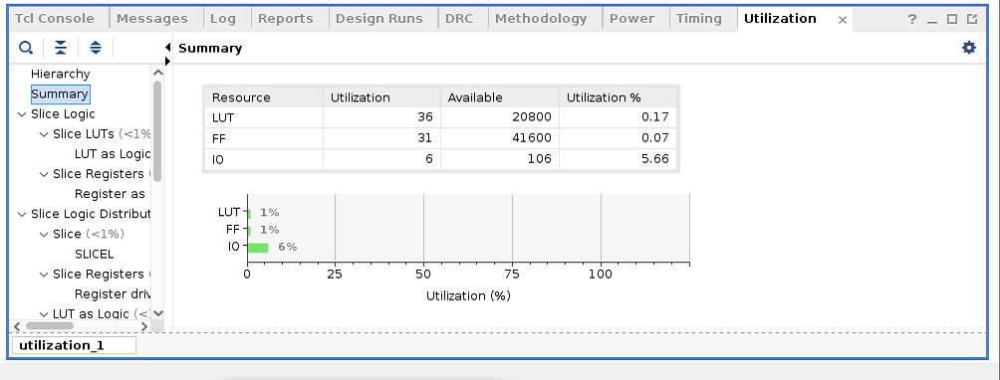

# FPGA - Fabric, Design and Architecture
  This repository contains all the information studied and created during the [FPGA - Fabric, Design and Architecture](https://www.vlsisystemdesign.com/fpga/) workshop. It is primarily foucused on a complete FPGA flow using the maximum open-soucre tools.

# Table of Contents
  - [Introduction To FPGA](#introduction-to-fpga)
    - [FPGA vs ASIC Comparison](#fpga-vs-asic-comparison)
  - [Introduction To Xilinx Vivado](#introduction-to-xilinx-vivado)
  - [List of All Open-Source Tools Used](#list-of-all-open-source-tools-used)
  - [Setting Up Environment](#setting-up-environment)
  - [Day 1 - Exploring FPGA Basics and Vivado](#day-1---exploring-fpga-basics-and-vivado)
    - [FPGA Basics](#fpga-basics)
      - [FPGA Architecture](#fpga-architecture)
      - [Configurable Logic Blocks](#configurable-logic-blocks)
      - [Basys FPGA Board](#basys-fpga-board)
    - [Counter Example in Vivado](#counter-example-in-vivado)
      - [Counter Simulation and Elaboration](#counter-simulation-and-elaboration)
      - [Counter Synthesis](#counter-synthesis)
      - [Counter Implementation](#counter-implementation)
      - [Constraints](#constraints)
      - [Bitstream](#bitstream)
      - [Counter Timing, Power and Area](#counter-timing-power-and-area)
    - [Introduction To VIO](#introduction-to-vio)
  - [Day 2 - Exploring OpenFPGA, VPR and VTR](#day-2---exploring-openfpga-vpr-and-vtr)
    - [Introduction To OpenFPGA](#introduction-to-openfpga)
    - [VPR](#vpr)
    - [VTR](#vtr)
      - [VTR Flow](#vtr-flow)
      - [Post Synthesis Simulation](#post-synthesis-simulation)
      - [Timing Area VTR Flow](#timing-area-vtr-flow)
      - [Power Analysis VTR](#power-analysis-vtr)
    - [Basys3 vs VTR Earch Comparison](#basys3-vs-vtr-earch-comparison)
  - [Day 3 - RISCV Core Programming Using Vivado](#day-3---riscv-core-programming-using-vivado)
    - [RTL To Synthesis](#rtl-to-synthesis)
    - [Synthesis To Bitstream](#synthesis-to-bitstream)
  - [Day 4 - Pre-layout timing analysis and importance of good clock tree](#day-4---pre-layout-timing-analysis-and-importance-of-good-clock-tree)
    - [Magic Layout to Standard Cell LEF](#magic-layout-to-standard-cell-lef)
    - [Timing Analysis using OpenSTA](#timing-analysis-using-opensta)
    - [Clock Tree Synthesis using TritonCTS](#clock-tree-synthesis-using-tritoncts)
  - [Day 5 - Final steps for RTL2GDS](#day-5---final-steps-for-rtl2gds)
    - [Generation of Power Distribution Network](#generation-of-power-distribution-network)
    - [Routing using TritonRoute](#routing-using-tritonroute)
    - [SPEF File Generation](#spef-file-generation)
  - [References](#references)
  - [Acknowledgement](#acknowledgement)
 
# Introduction To FPGA
  FPGA (Field Programmable Gate Array) are intergated circuits which have a complex arrangement of configurable logic blocks (CLBs) and programmable interconnects. 
 
 ## FPGA vs ASIC Comparison
   | FPGA                                                                         | ASIC                                           |
   | ---                                                                          | ---                                            |
   | Field Programmable Gate Array                                                | Application Specific Integrated Circuit        |
   | RTL to Bitstream                                                             | RTL to Layout                                  |
   | Reconfigurable Circuit                                                       | Permanent Circuit                              |
   | Less Energy Efficient. Required more power for same task as compared to ASIC | More energy efficient                          |
   | Useful for prototyping or validating a design                                | Used for final product design after validation |

# Introduction To Xilinx Vivado


# Day 1 - Exploring FPGA Basics and Vivado
 ## FPGA Basics
   ### FPGA Architecture
    The FPGA Architecture primarily consists of :
    - Configurable Logic Blocks
    - Programmable Interconnects 
    - I/O Cells
    - Memory / Block RAM
    
   
   

   ### Configurable Logic Block
    Configurable Logic Block (CLB) is responsible for the combinational or sequential logic implementation. CLB consists of :

    - Look-up Table (LUT) - Logic function implementation
    - Carry and Control Logic - Arithmetic Operations
    - Flip-flops and/or latches

   ### Basys FPGA Board

   

   | No  | Description               | No  | Description |
   | --- | ---                       | --- | ---         |
   | 01  | Power Good LED            | 09  | Reset       |
   | 02  | I/O                       | 10  |             |
   | 03  | I/O                       | 11  |             |
   | 04  | Four 7-segment Display    | 12  |             |
   | 05  | Slide switches            | 13  |             |
   | 06  | LEDs                      | 14  |             |
   | 07  | Pushbuttons               | 15  |             |
   | 08  | FPGA programming done LED | 16  |             |

 ## Counter Example in Vivado

   

   ### Counter Elaboration

   
   

   ### Counter Synthesis

   
   

   ### Counter Implementation

   ### Constraints

   ### Bitstream

   ### Counter Timing, Power and Area

      
   
   

 ## Introduction To VIO

# Day 2 - Exploring OpenFPGA, VPR and VTR

 ## Introduction To OpenFPGA
  The OpenFPGA framework is the first open-source FPGA IP generator which supports highly-customizable homogeneous FPGA architectures. OpenFPGA provides a full set of EDA support for customized FPGAs, including Verilog-to-bitstream generation and self-testing verification. OpenFPGA targets to democratizing FPGA technology and EDA techniques, with agile prototyping approaches and constantly evolving EDA tools for chip designers and researchers.

  Some key features of OpenFPGA are:
    - Use of Automation Techniques
    - Reduction of FPGA developement cycle to few days
    - Provides open source design tools 

   

 ## VPR
   VPR (Versatile Place and Route) is an open source academic CAD tool designed for the exploration of new FPGA architectures and CAD algorithms, at the packing, placement and routing phases of the CAD flow.
   As input, VPR takes a description of an FPGA architecture along with a technology-mapped user circuit. It then performs packing, placement, and routing to map the circuit onto the FPGA. The output of VPR includes the FPGA configuration needed to implement the circuit and statistics about the final mapped design (eg. critical path delay, area, etc). 

   

   To invoke VPR from terminal:
   ```
    $VTR_ROOT/vpr/vpr \
    $VTR_ROOT/vtr_flow/arch/timing/EArch.xml \
    <blif-file-path \
    --route_chan_width 100 \
    --disp on
   ```

   The basic VPR flow involves below mentioned steps:

    - Packing - combinines primitives into complex blocks
    - Placment - places complex blocks within the FPGA grid
    - Routing - determines interconnections between blocks
    - Analysis - analyzes the implementation

 ## VTR
   The Verilog to Routing (VTR) project provides open-source CAD tools for FPGA architecture and CAD research. The VTR design flow takes as input a Verilog description of a digital circuit, and a description of the target FPGA architecture.

   VTR perfoms:

    - Elaboration & Synthesis (ODIN II)
    - Logic Optimization & Technology Mapping (ABC)
    - Packing, Placement, Routing & Timing Analysis (VPR)

   To invoke VTR from command-line:
   ```
    $VTR_ROOT/vtr_flow/scripts/run_vtr_flow.py \ 
    $VTR_ROOT/doc/src/<verilog-file-path>
    $VTR_ROOT/vtr_flow/arch/timing/EArch.xml \
    -temp_dir . \
    --route_chan_width 100 
    
   ```
 ## VTR Flow
   ### Timing Area VTR Flow

    ```
     ## If constraint file is required
    --sdc_file <sdc-file-path>
    ```

   ### Post Synthesis Simulation
   Post Synthesis simulation in VTR flow is same as Post Implementation simulations in general. To generate the post synthesis netlist for simulation, the below mentioned switch should be enabled in during the VPR stage in VTR flow.
    ```
    ## To generate post synthesis netlist
    --gen_post_synthesis_netlist on
    ```

   :-------------------------:|:-------------------------:
     |  


   ### Power Analysis VTR
   VTR provides a option to perform power analysis over the design. To enable power analysis in command-line, the switch mentioned below should be used.

    ```
    ## For power analysis
    -power -cmos_tech $VTR_ROOT/vtr_flow/tech/PTM_45nm/45nm.xml
    ```

   The snippet below shows a brief summary of the power analysis report generated by the VTR flow.
   

 ## Basys3 vs VTR Earch Comparison

# Day 3 - RISCV Core Programming Using Vivado
 ## RTL To Synthesis](#rtl-to-synthesis)
 ## Synthesis To Bitstream](#synthesis-to-bitstream)
   
# References
  - VLSI System Design: https://www.vlsisystemdesign.com/ip/
  - 4-stage RISC-V Core: https://github.com/ShonTaware/RISC-V_Core_4_Stage
  - RISC-V based Microprocessor: https://github.com/shivanishah269/risc-v-core
  - https://openfpga.readthedocs.io/en/master/
  - https://docs.verilogtorouting.org/en/latest/vpr/
  - https://docs.verilogtorouting.org/en/latest/


# Acknowledgement
  - [Kunal Ghosh](https://github.com/kunalg123), Co-founder, VSD Corp. Pvt. Ltd.
  - 
